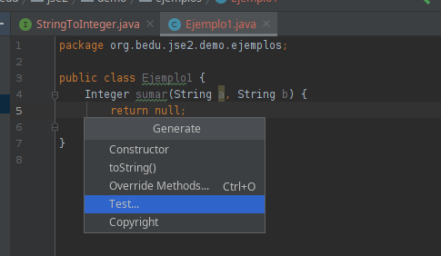

## Definiendo una interfaz funcional

### OBJETIVO
 - Conocer los elementos básicos de las interfaces funcionales en Java
 - Crear tu primera inerface funcional

### Prerequisitos

* Maven
* JDK 11

### Maven

Para ejecutar las pruebas de maven usa:
```bash
    mvn test
```

### Procedimiento

#### Definiendo la interfaz
1. Descarga el código del módulo (link pendiente)
1. En el paquete org.bedu.jse2.demo.ejemplos crea la interfaz StringToInteger
1. Anota la interfaz con _@FunctionalInterface_
1. Define el método abstracto
```java
   Integer convertir(String str);
```
#### Clase contenedora
1. Crea la clase Ejemplo1 en el paquete org.bedu.jse2.demo.ejemplos
1. Agrega el siguiente bloque de código
```java
Integer sumar(String a, String b){
  return null;
}
```

#### Prueba unitaria
1. Crea una prueba para la clase Ejemplo1
  
1. Agrega el siguiente código
```java
@Test
@DisplayName("Suma dos strings convertidos a enteros")
void addsUpTwoIntegers(){
    String a = "4";
    String b = "8";
    Integer expected = 12;

    Ejemplo1 ejemplo1 = new Ejemplo1();

    assertEquals(expected, ejemplo1.sumar(a,b));
}
```

Si ejecutas la prueba en este momento obtendrás un error ya que estamos regresando null.

#### Implementando la interfaz (clase anónima)

1. Reemplaza el código de la clase de la siguiente maner
```java
public class Ejemplo1 {

   private final StringToInteger parser = new StringToInteger() {
       @Override
       public Integer convertir(String str) {
           return Integer.parseInt(str);
       }
   };

    Integer sumar(String a, String b) {

        return parser.convertir(a) + parser.convertir(b);
    }
}
```
1. Vuelve a ejecutar la prueba

En este primer ejemplo estamos usando un método tradicional implementando una clase anónima.


#### Implementando la interfaz (lambda)

1. Reemplaza el código de la clase de la siguiente maner
```java
public class Ejemplo1 {

   private final StringToInteger parser = s -> Integer.parseInt(s);

    Integer sumar(String a, String b) {

        return parser.convertir(a) + parser.convertir(b);
    }
}
```
1. Vuelve a ejecutar la prueba

Esta vez hemos usado una lambda para proveer la implementación de la interfaz. El código es mucho más legible

#### Implementando la interfaz (referencia a método)

1. Reemplaza el código de la clase de la siguiente maner
```java
public class Ejemplo1 {

   private final StringToInteger parser =  Integer::parseInt;

    Integer sumar(String a, String b) {

        return parser.convertir(a) + parser.convertir(b);
    }
}
```
1. Vuelve a ejecutar la prueba

Finalmente, cuando una lambda simplemente pasa su argumento a un método, podemos reemplazarla por una referencia directa a ese método, como hicimos en este caso con Integer::parseInt.
